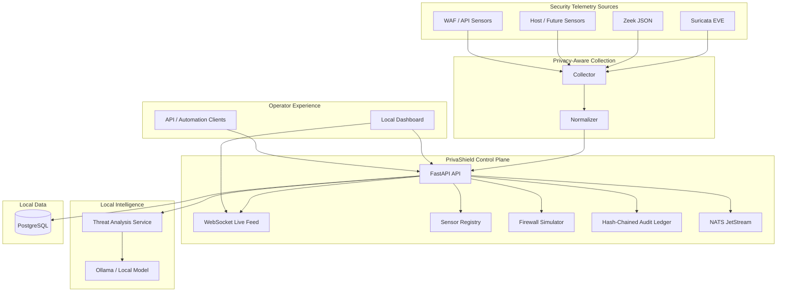
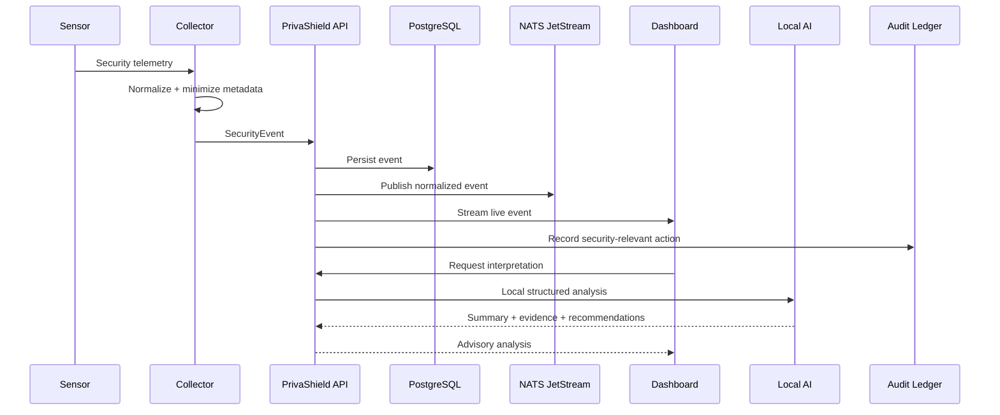
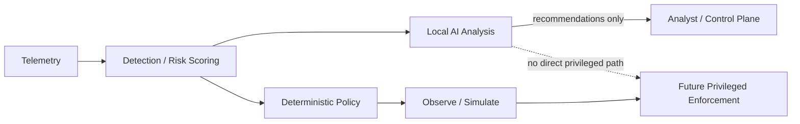

<div align="center">
  

# PrivaShield

### Local-first AI-assisted privacy and threat defense

**Self-hosted security telemetry, threat interpretation, firewall simulation, privacy-aware collection, and tamper-evident auditing in one open platform.**

[](https://github.com/drewc611/Privashield/actions/workflows/ci.yml)
[](https://github.com/drewc611/Privashield/actions/workflows/codeql.yml)
[](.github/workflows/dependency-review.yml)
[](LICENSE)
[](pyproject.toml)
[](apps/api)
[](docker-compose.yml)
[](docs/PRIVACY_ARCHITECTURE.md)
[](ROADMAP.md)

[Quickstart](#quickstart) · [Architecture](#architecture) · [Capabilities](#capabilities) · [Security Model](#security-model) · [Roadmap](#roadmap) · [Documentation](#documentation)

</div>

---

## What is PrivaShield?

PrivaShield is an open-source, self-hosted security platform for teams and operators that want useful AI-assisted threat analysis without placing a third-party cloud AI service inside the security trust boundary.

It combines network telemetry, normalized security events, local AI interpretation, sensor health, firewall simulation, real-time event streaming, and cryptographic audit logging behind a single control plane.

The project follows one non-negotiable architectural rule:

> **AI may analyze and recommend. Deterministic policy controls privileged enforcement.**

That keeps language-model latency and nondeterminism out of the packet fast path and prevents model output from becoming an uncontrolled privileged action.

## Why PrivaShield

Traditional security stacks often split IDS telemetry, packet metadata, AI interpretation, response logic, audit history, and operator controls across separate products. PrivaShield is being built as one local-first platform with explicit privacy and enforcement boundaries.

| Principle | What it means |
| --- | --- |
| **Local-first** | Security telemetry and AI analysis can stay on infrastructure you control. |
| **Privacy-minimized** | Collectors retain security-relevant features while sensitive application metadata remains opt-in. |
| **AI-assisted, not AI-controlled** | Local models explain and correlate. They do not directly mutate host or network state. |
| **Auditable decisions** | Detection, AI analysis, simulation, and control-plane actions are designed to produce integrity-checkable records. |
| **Safe rollout** | Enforcement progresses through observe, simulate, testing, and explicit approval gates before activation. |
| **Open architecture** | Sensors, model runtimes, policy engines, and future enforcement components are replaceable modules. |

## Capabilities

### Implemented in the Phase 1 platform

- FastAPI control plane with typed Pydantic contracts
- Canonical `SecurityEvent` model
- PostgreSQL event persistence
- Suricata EVE JSON normalization
- Zeek JSON normalization
- Privacy-minimized collector defaults
- NATS JetStream event publishing
- Real-time WebSocket event fanout
- Sensor heartbeat and health registry
- Ollama-compatible local AI threat interpretation
- Schema-constrained AI analysis output
- Firewall allow/drop **simulation**
- Tamper-evident SHA-256 hash-chain audit ledger
- Docker Compose local stack
- GitHub Actions CI, CodeQL, dependency review, and Dependabot
- Repository-level specialist agents governed by a shared safety harness

### In active development

- Local single-pane security dashboard
- AI analyst workflow and event investigation UI
- Detection/risk-scoring service
- Sensitive-data classification service
- Expanded operations and release packaging

### Planned lifecycle capabilities

- PII / PHI / financial / credential classification
- Behavioral ransomware and mass-encryption detection
- User and entity anomaly detection
- Smart DLP and policy-based redaction
- Reverse-proxy / WAF integration
- eBPF/XDP high-speed data plane
- Controlled quarantine and SOAR workflows
- Signed releases and hardened production deployment profiles

## Architecture



### Event flow



### Trust and enforcement boundary



The dashed path is intentionally prohibited. Model output does not directly become an operating-system firewall, identity, process-control, or quarantine action.

## Security model

PrivaShield is being developed as a security product, so security controls are repository requirements rather than optional release polish.

- Local-first processing is the default architecture.
- Packet payload capture is not enabled by default.
- DNS names, HTTP hosts, TLS SNI, and similar application identifiers remain controlled metadata.
- AI authority is advisory-only.
- Phase 1 firewall behavior is `observe` or `simulate` only.
- Audit entries are hash chained for tamper evidence.
- CodeQL and dependency review run in GitHub Actions.
- Dependabot tracks Python and GitHub Actions dependency updates.
- Automated agents are constrained by `.github/AGENT_HARNESS.md`.

See [SECURITY.md](SECURITY.md), [Threat Model](docs/THREAT_MODEL.md), [Security Architecture](docs/SECURITY_ARCHITECTURE.md), and [Privacy Architecture](docs/PRIVACY_ARCHITECTURE.md).

## Agent team

PrivaShield includes repository-level specialist agents for bounded project work:

- Project Manager
- Security Architect
- Backend Engineer
- Dashboard Engineer
- QA and Release
- Product and Documentation

Every agent must follow the shared [Agent Harness](.github/AGENT_HARNESS.md). The harness prevents autonomous privileged enforcement, production release, destructive repository operations, secret handling, security-control weakening, and other approval-gated actions.

## Quickstart

### Requirements

- Docker Engine or Docker Desktop
- Docker Compose v2
- Git
- Python 3.12+ for non-container development

### Start the local stack

```bash
git clone https://github.com/drewc611/Privashield.git
cd Privashield
cp .env.example .env
docker compose up --build
```

### Local endpoints

| Service | Address |
| --- | --- |
| API | `http://127.0.0.1:8000` |
| OpenAPI / Swagger | `http://127.0.0.1:8000/docs` |
| Health | `http://127.0.0.1:8000/api/v1/health` |
| System status | `http://127.0.0.1:8000/api/v1/system/status` |
| Live events | `ws://127.0.0.1:8000/api/v1/ws/events` |

PostgreSQL, NATS, and Ollama run inside the local Compose network by default rather than being exposed publicly.

## Collector examples

### Suricata

```bash
PYTHONPATH=apps/api:services/collector \
python -m privashield_collector \
  --source suricata \
  --file /var/log/suricata/eve.json \
  --follow
```

### Zeek

```bash
PYTHONPATH=apps/api:services/collector \
python -m privashield_collector \
  --source zeek \
  --file /opt/zeek/logs/current/conn.log \
  --zeek-log-type conn \
  --follow
```

Application-layer metadata is excluded by default. Enable it only when the deployment has a legitimate need and appropriate retention policy.

## Repository structure

```text
Privashield/
├── .github/
│   ├── agents/              # Constrained specialist agents
│   └── workflows/           # CI and security automation
├── apps/
│   ├── api/                 # FastAPI control plane
│   └── dashboard/           # Local operator UI (active development)
├── services/
│   └── collector/           # Suricata and Zeek normalization
├── docs/
│   ├── adr/                 # Architecture decisions
│   └── assets/              # Repository visual assets
├── tests/                   # Automated regression/security tests
├── docker-compose.yml       # Local deployment stack
├── pyproject.toml           # Python project configuration
└── README.md
```

## Development

```bash
python -m pip install -e ".[dev]"
ruff check .
pytest -q
```

Changes should go through feature branches and pull requests. Security-sensitive changes must include explicit security/privacy impact and rollback notes.

## Roadmap

### Phase 1: local MVP

- [x] Project and governance foundation
- [x] FastAPI control plane
- [x] Canonical security-event model
- [x] PostgreSQL persistence
- [x] Suricata collector
- [x] Zeek collector
- [x] NATS JetStream publishing
- [x] Sensor heartbeat registry
- [x] WebSocket live-event transport
- [x] Local AI analysis interface
- [x] Firewall simulation boundary
- [x] Tamper-evident audit ledger
- [x] CI and security scanning foundation
- [ ] Local operator dashboard
- [ ] Phase 1 end-to-end acceptance suite
- [ ] First signed pre-release

### Phase 2: detection and privacy intelligence

- Sensitive-data classification
- Behavioral ransomware detection
- User/entity anomaly detection
- DLP policy engine
- WAF integration
- Incident investigation workflows

### Phase 3: controlled enforcement

- eBPF/XDP data plane
- Deterministic enforcement service
- Explicit approval and rollback controls
- Network/session quarantine
- Expanded SOAR adapters

See [ROADMAP.md](ROADMAP.md) for the maintained project roadmap.

## Documentation

| Area | Document |
| --- | --- |
| Requirements | [docs/REQUIREMENTS.md](docs/REQUIREMENTS.md) |
| MVP | [docs/MVP.md](docs/MVP.md) |
| Architecture | [docs/ARCHITECTURE.md](docs/ARCHITECTURE.md) |
| API | [docs/API.md](docs/API.md) |
| Data model | [docs/DATA_MODEL.md](docs/DATA_MODEL.md) |
| Threat model | [docs/THREAT_MODEL.md](docs/THREAT_MODEL.md) |
| Security architecture | [docs/SECURITY_ARCHITECTURE.md](docs/SECURITY_ARCHITECTURE.md) |
| Privacy architecture | [docs/PRIVACY_ARCHITECTURE.md](docs/PRIVACY_ARCHITECTURE.md) |
| AI governance | [docs/AI_MODEL_GOVERNANCE.md](docs/AI_MODEL_GOVERNANCE.md) |
| SDLC | [docs/SDLC.md](docs/SDLC.md) |
| Development | [docs/DEVELOPMENT.md](docs/DEVELOPMENT.md) |
| Deployment | [docs/DEPLOYMENT.md](docs/DEPLOYMENT.md) |
| Operations | [docs/OPERATIONS.md](docs/OPERATIONS.md) |
| Testing | [docs/TESTING.md](docs/TESTING.md) |
| Agent safety harness | [.github/AGENT_HARNESS.md](.github/AGENT_HARNESS.md) |

## Production-readiness notice

PrivaShield is under active development. Do **not** treat the current codebase as a production enforcement control. Active packet dropping, autonomous quarantine, destructive response actions, and direct model-driven enforcement are intentionally unavailable in Phase 1.

## Contributing

Read [CONTRIBUTING.md](CONTRIBUTING.md), [SECURITY.md](SECURITY.md), and [CODE_OF_CONDUCT.md](CODE_OF_CONDUCT.md) before contributing.

## License

Apache License 2.0. See [LICENSE](LICENSE).
