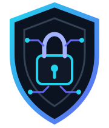
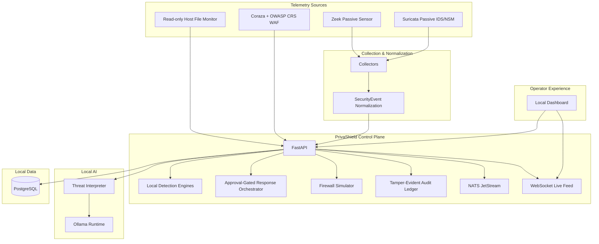
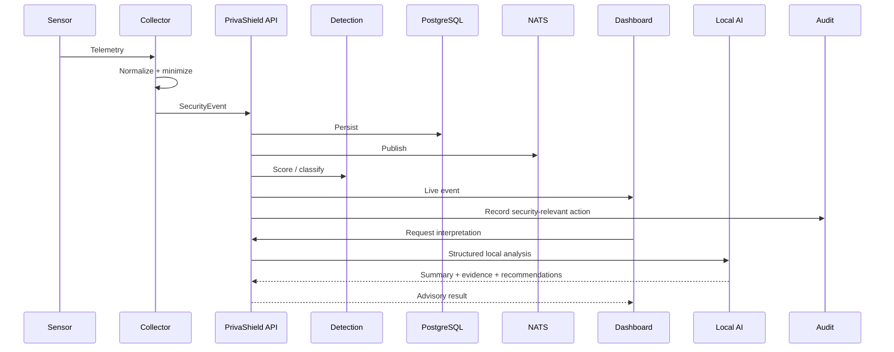
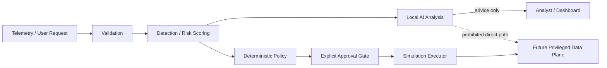

<div align="center">
  

# PrivaShield

### Local-first AI-assisted privacy and threat defense

**Self-hosted network telemetry, detection, privacy controls, local AI analysis, WAF protection, response orchestration, and tamper-evident auditing in one platform.**

[](https://github.com/drewc611/Privashield/actions/workflows/ci.yml)
[](https://github.com/drewc611/Privashield/actions/workflows/codeql.yml)
[](LICENSE)
[](pyproject.toml)
[](apps/api)
[](docker-compose.yml)
[](docs/PRIVACY_ARCHITECTURE.md)
[](docs/AI_MODEL_GOVERNANCE.md)
[](docs/SECURITY_ARCHITECTURE.md)

[Quickstart](#quickstart) · [Architecture](#architecture) · [Capabilities](#capabilities) · [Dashboard](#dashboard) · [Security Model](#security-model) · [Roadmap](#roadmap)

</div>

---

## What is PrivaShield?

PrivaShield is an open-source, self-hosted security platform for teams that want modern threat analysis and privacy controls without making a third-party cloud AI service part of the security trust boundary.

It combines live network sensors, normalized security events, local detection engines, privacy-aware DLP, local AI interpretation, WAF protection, approval-gated response workflows, host file monitoring, firewall simulation, and cryptographic audit logging behind one local control plane and dashboard.

The architecture follows one non-negotiable rule:

> **AI may analyze and recommend. Deterministic policy controls privileged enforcement.**

PrivaShield currently detects, scores, simulates, and orchestrates defensive actions. Direct host/network enforcement remains intentionally disabled until a separately reviewed privileged data plane is introduced.

## Why PrivaShield

| Principle | What it means |
| --- | --- |
| **Local-first** | Telemetry, detection logic, dashboard data, and local AI analysis can stay on infrastructure you control. |
| **Privacy-minimized** | Collectors keep security-relevant features while sensitive application metadata is opt-in. |
| **AI-assisted, not AI-controlled** | Local models summarize and recommend. They cannot directly mutate host or network state. |
| **Defense in depth** | Network sensing, WAF, file monitoring, DLP, anomaly scoring, and response workflows live behind one control plane. |
| **Auditable decisions** | Security-relevant control-plane actions are designed to produce tamper-evident audit records. |
| **Approval-gated response** | Response workflows require explicit approval and remain simulation-only today. |
| **Open architecture** | Sensors, models, policy engines, and future enforcement components are modular. |

## Capabilities

### Network visibility

- Passive Suricata IDS/NSM sensor profile
- Passive Zeek network-analysis sensor profile
- Privacy-aware Suricata EVE and Zeek JSON normalization
- Canonical `SecurityEvent` model across sensor sources
- NATS JetStream publication and WebSocket live-event delivery
- Sensor registration, heartbeat, and health status

### Detection and privacy

- Local DLP classification for PII, PHI-context, financial data, payment cards, credentials, and secrets
- Permission-tier redaction
- Identity anomaly scoring, including impossible-travel and rapid-download signals
- Ransomware behavior scoring for mass file operations, renames, extension changes, entropy, and directory spread
- Local file-risk scoring for signatures, executable disguises, and entropy
- Read-only host filesystem monitoring with bounded entropy sampling

### AI analysis

- Ollama-compatible local model runtime
- Structured threat summaries
- Evidence and confidence reporting
- Recommended analyst actions
- Advisory-only AI authority

### Perimeter and response

- Coraza + Caddy WAF profile using OWASP Core Rule Set
- JSON WAF audit logging
- Firewall allow/drop simulation
- Approval-gated response-action state machine
- Simulated workflows for block IP, isolate interface, terminate session, revoke token, quarantine file, and stop process
- Explicit `privileged_execution=false` capability boundary

### Operator experience

- Local single-pane dashboard
- Live WebSocket activity feed
- Event metrics and event table
- AI Firewall simulation controls
- Threat Interpreter panel
- Sensor health view
- Cryptographic audit verification view
- Loopback-only local publishing through the reverse proxy

### Software assurance

- GitHub Actions CI
- Ruff and Pytest quality gates
- Dashboard JavaScript syntax checks
- Docker Compose validation
- CodeQL scanning
- Pull-request dependency review
- Dependabot for Python and GitHub Actions
- Repository-level specialist agents governed by a shared harness

## Architecture



### Event and analysis flow



### Trust and enforcement boundary



**Current state:** the future privileged data plane does not exist. Response actions and firewall outcomes remain simulated and report `enforced=false`.

## Dashboard

The local dashboard is designed as a security console rather than a generic admin panel. It provides:

- current system and sensor state;
- live security activity;
- severity/source metrics;
- AI-assisted alert interpretation;
- simulated firewall controls;
- response workflow state;
- audit-chain verification.

The dashboard is published locally through the reverse proxy. Direct dashboard host publishing is disabled in the packaged stack.

## Security model

PrivaShield treats security boundaries as repository requirements:

- packet sensors are passive in the current profiles;
- packet payload retention is not enabled by default;
- application identifiers such as DNS names, HTTP hosts, and TLS SNI remain controlled metadata;
- the host monitor receives a read-only monitored-directory mount;
- AI has no privileged execution path;
- response actions require approval and execute in simulation mode;
- audit history is hash chained for tamper evidence;
- WAF protection is separate from model inference;
- only packet-capture sensor containers receive capture privileges;
- collectors and control-plane services remain unprivileged;
- automated project agents are constrained by `.github/AGENT_HARNESS.md`.

See [SECURITY.md](SECURITY.md), [Threat Model](docs/THREAT_MODEL.md), [Security Architecture](docs/SECURITY_ARCHITECTURE.md), and [Privacy Architecture](docs/PRIVACY_ARCHITECTURE.md).

## Agent team

PrivaShield includes bounded repository-level specialist agents:

| Agent | Responsibility |
| --- | --- |
| Project Manager | Roadmap, PR sequencing, blockers, delivery priorities |
| Security Architect | Threat model, privacy boundaries, trust and enforcement review |
| Backend Engineer | FastAPI, collectors, persistence, NATS, local AI services |
| Dashboard Engineer | Operator console, live feed, investigation UX |
| QA & Release | CI, regression testing, dependency/security gates, release readiness |
| Product & Docs | README, diagrams, product documentation, release messaging |

All agents must follow the shared [Agent Harness](.github/AGENT_HARNESS.md). They cannot autonomously enable privileged enforcement, publish production releases, weaken security controls, expose secrets, perform destructive repository actions, or cross other explicit human-approval gates.

## Quickstart

### Requirements

- Docker Engine or Docker Desktop
- Docker Compose v2
- Git

### Run the local stack

```bash
git clone https://github.com/drewc611/Privashield.git
cd Privashield
cp .env.example .env
docker compose up --build
```

The packaged services are designed for local/self-hosted use. See [docs/DEPLOYMENT.md](docs/DEPLOYMENT.md) and the service-specific operations documentation before enabling optional sensor profiles.

### Development checks

```bash
python -m pip install -e ".[dev]"
ruff check .
pytest -q
```

## Repository structure

```text
Privashield/
├── .github/
│   ├── agents/              # Constrained specialist agents
│   └── workflows/           # CI and security automation
├── apps/
│   ├── api/                 # FastAPI control plane
│   └── dashboard/           # Local operator UI
├── services/                # Collectors, monitors, supporting services
├── docs/
│   ├── adr/                 # Architecture decisions
│   └── assets/              # Repository visual assets
├── tests/                   # Regression and security-boundary tests
├── docker-compose.yml       # Self-hosted local stack
├── pyproject.toml           # Python project configuration
└── README.md
```

## Roadmap

### Completed foundation

- [x] Project governance and architecture documentation
- [x] FastAPI control plane and canonical event model
- [x] PostgreSQL persistence
- [x] Suricata and Zeek normalization
- [x] NATS + WebSocket realtime transport
- [x] Local AI threat-analysis interface
- [x] Tamper-evident audit ledger
- [x] Local dashboard and self-hosted stack
- [x] Local DLP and redaction
- [x] Identity anomaly detection
- [x] Ransomware behavior scoring
- [x] File-risk scoring and read-only host monitor
- [x] WAF integration
- [x] Approval-gated response orchestration in simulation mode
- [x] Live passive Zeek/Suricata sensor profile

### Next engineering milestones

- Detection correlation and incident grouping
- Expanded policy management and analyst workflows
- Performance/load characterization
- End-to-end acceptance and security regression suite
- Signed pre-release artifacts
- Hardened deployment profiles

### Future controlled enforcement

- eBPF/XDP data plane
- deterministic privileged enforcement service
- explicit approval, rollback, and recovery controls
- carefully scoped network/session quarantine
- expanded SOAR adapters

See [ROADMAP.md](ROADMAP.md) for the maintained project plan.

## Documentation

| Area | Document |
| --- | --- |
| Requirements | [docs/REQUIREMENTS.md](docs/REQUIREMENTS.md) |
| Architecture | [docs/ARCHITECTURE.md](docs/ARCHITECTURE.md) |
| API | [docs/API.md](docs/API.md) |
| Data model | [docs/DATA_MODEL.md](docs/DATA_MODEL.md) |
| Threat model | [docs/THREAT_MODEL.md](docs/THREAT_MODEL.md) |
| Security architecture | [docs/SECURITY_ARCHITECTURE.md](docs/SECURITY_ARCHITECTURE.md) |
| Privacy architecture | [docs/PRIVACY_ARCHITECTURE.md](docs/PRIVACY_ARCHITECTURE.md) |
| AI governance | [docs/AI_MODEL_GOVERNANCE.md](docs/AI_MODEL_GOVERNANCE.md) |
| Development | [docs/DEVELOPMENT.md](docs/DEVELOPMENT.md) |
| Deployment | [docs/DEPLOYMENT.md](docs/DEPLOYMENT.md) |
| Operations | [docs/OPERATIONS.md](docs/OPERATIONS.md) |
| Testing | [docs/TESTING.md](docs/TESTING.md) |
| Agent safety | [.github/AGENT_HARNESS.md](.github/AGENT_HARNESS.md) |

## Production-readiness notice

PrivaShield is under active development. The current repository should not be treated as a production privileged-enforcement control. Packet dropping, destructive response, credential revocation, host isolation, and direct model-driven enforcement remain intentionally unavailable.

## Contributing

Read [CONTRIBUTING.md](CONTRIBUTING.md), [SECURITY.md](SECURITY.md), and [CODE_OF_CONDUCT.md](CODE_OF_CONDUCT.md) before contributing.

## License

Apache License 2.0. See [LICENSE](LICENSE).
