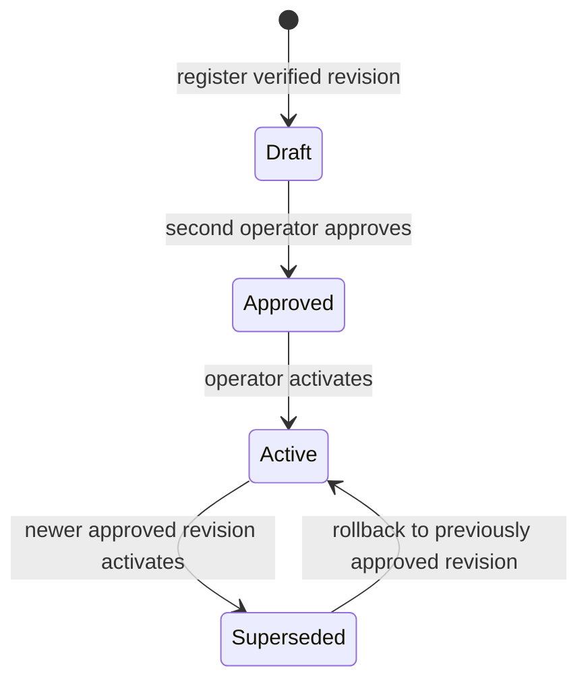

# Signed Policy Governance

PrivaShield uses deterministic, versioned Ed25519-signed policy documents to govern response **simulation**. Policy activation does not enable privileged execution and does not invoke a response action by itself.

## Security boundary

The running PrivaShield API holds only an Ed25519 **public verification key**. The private signing key stays outside the API and should be protected by the operator's normal secret-management process.

This separation means compromise of the API's policy-verification configuration does not provide the private key required to mint a valid new policy signature.

Current policy capability remains deliberately constrained:

- `mode` is `observe` or `simulate` only;
- `require_human_approval` is always `true`;
- `privileged_execution` is always `false`;
- activation is recorded as `simulation-governance-only`;
- activation never creates, approves, or executes a response action;
- AI has no signing, approval, activation, rollback, or enforcement authority.

## Policy lifecycle



Each revision has a stable `policy_id` and a monotonically increasing integer `version`. A new revision must be exactly one version greater than the latest stored revision for that policy ID.

## Signature format

The signed payload is canonical JSON containing:

- algorithm (`ed25519`);
- policy document;
- key ID;
- policy ID;
- version.

Canonical serialization sorts keys and uses compact JSON separators before signing. The stored `content_digest` is a SHA-256 digest of the same canonical payload and is checked again before approval, activation, and rollback.

The Ed25519 signature is stored as 128 lowercase hexadecimal characters.

## Policy document constraints

A policy document contains:

- a name and optional description;
- allowed simulated response-action types;
- a deterministic minimum risk score;
- mandatory human approval;
- an `observe` or `simulate` mode;
- an immutable `privileged_execution=false` boundary;
- a schema version.

The policy model intentionally does not contain commands, scripts, shell fragments, model prompts, executable code, credentials, or network-enforcement instructions.

## Two-person approval

The operator string that registers a revision cannot approve that same revision. This is a basic separation-of-duties control.

The current application does not yet have RBAC or an external identity provider, so actor strings are **not identity-verified claims**. Approval/history records explicitly preserve that limitation. RBAC and external identity integration remain separate roadmap work.

## Version and history persistence

When PostgreSQL is enabled, PrivaShield persists:

- every policy revision;
- content digest and signature;
- status transitions;
- creator, approver, and activator strings;
- approval and activation timestamps;
- append-only policy transition history.

A revision transition and its corresponding policy-history records are committed in the same database transaction. In-memory repositories are used only when database persistence is disabled.

Security-relevant policy API operations are also written to the existing tamper-evident application audit ledger.

## Rollback

Rollback selects an already stored, previously approved older revision. It does not reconstruct policy content or accept a new unsigned document.

Before rollback, PrivaShield re-verifies the stored Ed25519 signature and content digest. The current active revision is marked superseded and the approved target becomes active for simulation governance.

This is **policy revision rollback only**. It is not yet the future privileged-enforcement kill switch or enforcement rollback qualification identified in the roadmap.

## Generate a key pair

Create an Ed25519 private key outside the PrivaShield API host or process boundary:

```bash
openssl genpkey -algorithm Ed25519 -out policy-ed25519.pem
```

If the PEM is encrypted, set `PRIVASHIELD_POLICY_SIGNING_KEY_PASSWORD` only in the offline signing environment.

Export the corresponding public key in the base64 raw-key format expected by PrivaShield:

```bash
python scripts/export_policy_public_key.py --private-key policy-ed25519.pem
```

Configure only that output on the API:

```bash
export PRIVASHIELD_POLICY_VERIFICATION_PUBLIC_KEY='<base64-public-key>'
export PRIVASHIELD_POLICY_VERIFICATION_KEY_ID='local-v1'
```

Do not copy the private key to the API configuration.

## Sign a policy offline

Create a JSON document matching `PolicyDocument`, for example:

```json
{
  "name": "High confidence response simulation",
  "description": "Allow selected response simulations for high-confidence detections.",
  "allowed_actions": ["block_ip", "quarantine_file"],
  "minimum_risk_score": 0.85,
  "require_human_approval": true,
  "mode": "simulate",
  "privileged_execution": false,
  "schema_version": "1.0"
}
```

Then sign it with the offline private key:

```bash
python scripts/sign_policy.py \
  --document policy.json \
  --private-key policy-ed25519.pem \
  --policy-id 00000000-0000-4000-8000-000000000001 \
  --version 1 \
  --key-id local-v1 > policy-envelope.json
```

The signing utility outputs only the signed envelope. It does not print the private key.

## API surface

| Method | Endpoint | Purpose |
| --- | --- | --- |
| `GET` | `/api/v1/policies/capabilities` | Report verification and enforcement boundaries |
| `POST` | `/api/v1/policies/revisions` | Register a signed, verified revision |
| `GET` | `/api/v1/policies/{policy_id}/revisions` | List all revisions |
| `GET` | `/api/v1/policies/{policy_id}/revisions/{version}` | Read one revision |
| `POST` | `/api/v1/policies/{policy_id}/revisions/{version}/approve` | Record second-operator approval |
| `POST` | `/api/v1/policies/{policy_id}/revisions/{version}/activate` | Activate for simulation governance only |
| `GET` | `/api/v1/policies/{policy_id}/active` | Read the active revision |
| `GET` | `/api/v1/policies/{policy_id}/history` | Read append-only transition history |
| `POST` | `/api/v1/policies/{policy_id}/rollback` | Roll back to a previously approved older revision |

## Key rotation

The first implementation supports one configured verification key ID at a time. Existing revisions remain stored after a key rotation, but transitions requiring signature verification will fail closed unless their key is currently configured.

A future key-ring implementation can support overlapping verification keys and explicit key retirement without placing signing keys in the API.

## Non-goals

This feature does not:

- enable nftables, iptables, eBPF, XDP, quarantine, session revocation, or process termination;
- convert model output into policy;
- make policies self-approving;
- make policies executable code;
- qualify production enforcement;
- replace RBAC or identity verification;
- constitute release signing or artifact attestation.
